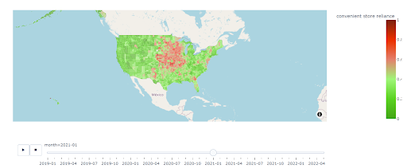

# Summary Guide

A summary of the food_dash is provided here 

The complete documentation could be found at https://cja5553.github.io/food_dash/ 

## food_dash Documentation

This food_dash is used to prepare supplemental materials for the project titled "Using mobile-phone data to assess racial disparities surrounding unhealthy food reliance during the COVID-19 pandemic". 

However, it can also be utilized with datasets that draw similarity to the structure of our dataset - that is - monthly datasets aggregated data at a county level, of which we wish to measure the percent of one variable over the percent of the sum of 2 variables [ie x=a/(a+b)]. 

The goal is to ultimately plot a dashboard visualizing spatio-temporal elements, with the temporal aspect being monthly, and the spatial aspect being at a county level

### About the data

The data, found under the data folder, contains visitation data that has been aggregated in the county-level. The original data, which was purchased through a proprietary data-service provider, contains coordinate specific data of the following details: (1) the origins of the consumer, (2) the coordinates and business-brand of the location visited, and (3) the week of which the visitation occured. For the purposes of our study, this data was aggregated at a county-level. Following so, we overlayed and merged the data with shapefiles with data from the US census, primarily using the software QGIS. The data reflected in this project is thus the data that proceeded immediately after the aforementioned merging process.

We hence have 4 datasets, each encompassing the following categories: (1) "fast-food", (2) "full-service restaurants", (3) "convenience-store", and (4) "grocery-store". The data is provided in 4 individual categories because when dealing with the raw data, each of these above-mentioned categories were selected based on drastically different criterions and were hence dealt with seperately.

To view the data, 

```python
>>> from pandas import pd
>>> # reading the data for convenient store category 
>>> df1=pd.read_csv("data/convenient_store_aggregated_by_county.csv",index_col=False)
>>>  print(df.head(1))

| date_range_start | County |             Type | month_count |
|-----------------:|-------:|-----------------:|------------:|
|          2019-01 |   1001 | convenient store |        1353 |

```

As shown above, the raw data contains 4 columns:
- date_range_start: the month of which the visitation count amongst each attribute occured
- county: the county FIPS code of which the visitation count occured
- Type: The categorical attribute of which we are counting
- month_count: number of visitors to the category within the county from the respective month. 


### Getting Started

#### Requirements

The following packages are required in order to run use *food_dash*

```python
>>> pip install pandas
>>> pip install plotly
>>> pip install plotly.express
>>> pip install datetime
>>> pip install urlopen
```

#### Installation

The best way to use this is to simply directly use the code provided in *execution.ipynb* or create a .py or .ipynb similar to that in the *food_dash* folder. To do so, simply import the functions using 

```python
>>> from clean_normalize_data import *
>>> from dashboard_creation import *
```

If you'd prefer having the file to execute your code outside the *food_dash* folder, simply do the following:
```python
>>> from food_dash.clean_normalize_data import *
>>> from food_dash.dashboard_creation import *
```

### Quick Usage Overview

Here, we provide a quick overview of how these function works and how you can quickly obtain your spatio-temporal dashboard. 

Do note that the datasets that are fed into the ``preparing_data_for_viz`` function assumes that the columns for your dates are "date_range_start" and the columns for the counties are called "Counties". 

To see how each specific function works, refer to the *User List* for tab. 

```python
# executing the creation of dashboard here. 

from clean_normalize_data import *
from dashboard_creation import *

# This examples creates and saving dashboard for convenience store reliance.

# read your first dataset. In this case, it is the semi-aggregated convenience store visits file
>>> df1=pd.read_csv("data/convenient_store_aggregated_by_county.csv",index_col=False) 

# read your second dataset, in this case, the semi-aggregated grocery visits file
>>> df2=pd.read_csv("data/grocery_aggregated_by_county.csv",index_col=False)

# using the preparing data_for_viz_function to clean the data, normalize it, calculate the "convenience store reliance index" and prepare the data for visualization. 
>>> data=preparing_data_for_viz(df1=data_convenience,df2=data_fast_food
>>>        unhealthy_col_name="convenient store_count",
>>>        healthy_col_name="supermarket_count",
>>>         desired_col_name="convenient store reliance")  
>>> print(data.head(1))
|   Month |  County | Convenience store reliance |
|--------:|--------:|---------------------------:|
| 2019-01 | "01001" |                    0.23885 |


# reading the built-in encoded red-to-green scale
>>> cc_scale=green_red_col_scale()  
# reading the county shapefiles 
>>> counties=loading_counties_file() 

#creating and saving the dashboards. 
>>> show_and_save_plot(save_name="dashboard/convenience_store_reliance_plot.html" attribute_name="convenient store reliance",cc_scale=cc_scale,data=data, counties=counties)
```
The following output is the dashboard produced. 



